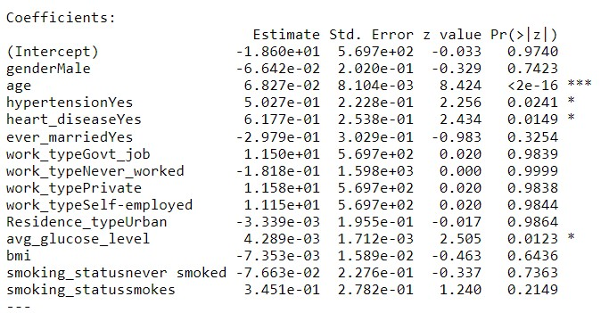
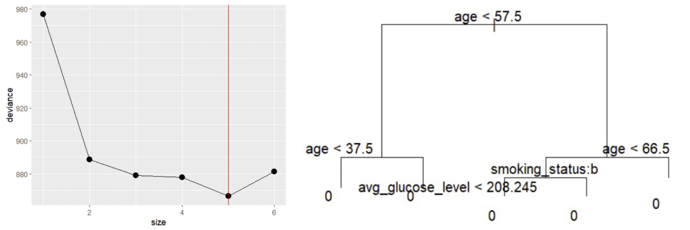
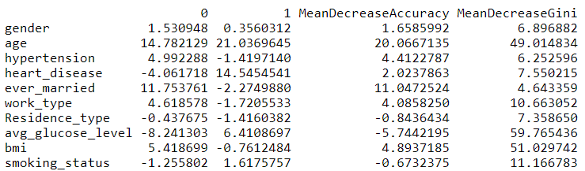
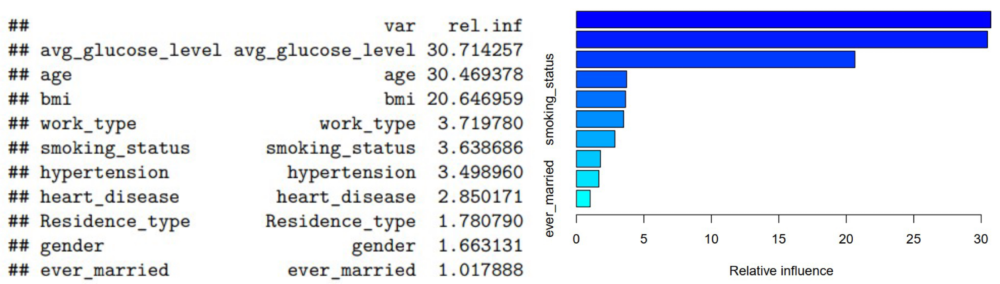

```{r setup, include=FALSE}
knitr::opts_chunk$set(echo = TRUE)
```


```{r, include=FALSE}
rm (list = ls()) 
library(r02pro)    
library(tidyverse)  
library(MASS)
library(ISLR)
library(leaps)
library(glmnet)
library(caret)
library(tree)
library(dplyr)
library(randomForest)
library(gbm)
library(purrr)
library(tidyr)
library(ggplot2)
stroke <- read.csv("healthcare-dataset-stroke-data.csv")
```


# Introduction

Stroke is a serious global health issue and is considered one of the leading causes of mortality worldwide. This condition is categorized into two types: ischemic stroke and hemorrhagic stroke, both of which can result in disabilities or death. Therefore, identifying individuals who are at high risk of stroke is of utmost importance for public health. 


According to Jackson et al. (2020), this study found that the overall awareness of stroke signs and symptoms is very low. The authors suggested that certain public health interventions should be implemented among the greater population since the consequences cannot be reversed. Thus, in our study, we aim to develop a predictive model that can estimate the likelihood of individuals having a stroke based on their demographic information, such as age, gender, and lifestyle factors such as smoking status, as well as their medical history, including heart disease, hypertension, and average glucose level. We will use Stroke Prediction Dataset which is publicly available on Kaggle and the link for this dataset is. This dataset contains 5110 observations with 12 features that can be categorized into three groups: demographic, lifestyle factors, and pre-existing health conditions. Before doing any analysis, we will exclude missing values and certain unrealistic figures. Then, we will split the dataset into training and test datasets before applying machine learning algorithms. To predict the likelihood of an individual having a stroke, we will use logistic regression, Decision Trees, Random Foresting, and Boosting. The model will use the feature `stroke` as the response variable and the rest will be predictive variables. Overall, we will use the 95% significance to test our models. 

# Related Work

The diagnosis of TIA or minor stroke can be very challenging (Perry et al., 2022). One of the significant obstacles to the accurate diagnosis of stroke is the delay in seeking medical attention. Individuals may fail to recognize the symptoms of a stroke or hesitate to seek prompt medical care, which can result in unfavorable outcomes. Stroke is a medical emergency, and timely intervention is crucial to minimize the risk of complications and optimize recovery. Therefore, to overcome the challenges of stroke diagnosis and improve patient outcomes, the use of prediction models in machine learning is becoming increasingly important. By incorporating a range of factors, including demographics, medical history and lifestyle factors, these models can provide accurate predictions of an individual's stroke risk. This information can help healthcare providers tailor their approach to stroke prevention and provide timely interventions to those at highest risk. 

While various aspects of stroke prediction have been investigated in existing literature, research involving machine learning algorithms is still relatively rare. Li et al. (2023) conducted a cohort study on stroke prediction and found a strong association between stroke and diseases such as hypertension and diabetes. Meanwhile, Ashrafuzzaman et al. (2022) developed a model based on deep CNN, but they did not identify which features have the greatest impact on the model.

The results from different techniques may vary due to various factors such as the selected features, data cleaning approaches, and imputation of missing values. Therefore, it is essential for researchers to understand how different input factors relate to each other and how they affect the final model's accuracy. Instead of using all the available features in the feature space, it is crucial to identify the perfect combination of features. Doing so can help improve the accuracy of the model and reduce the potential for overfitting.

# Methods

We are going to develop machine learning models for predicting the likelihood of an individual having a stroke based on their demographic, lifestyle, and health information. We will compare the performance of four classification models, namely logistic regression, decision tree, random forest, and boosting, to determine which model produces the best stroke prediction outcomes. In the dataset Stroke, we are going to use the variable `stroke` as the response variable and the rest as predictors. Each model will be adjusted based on its features, such as we will find the best size of the pruned decision tree, etc. 

Logistic Regression:

The logistic regression model uses a logistic function to estimate the probability of the outcome variable given predictors. It analyzes the relationship between binary outcome variables and other predictor variables. Based on the stroke dataset, a logistic regression model will be used to predict the likelihood of an individual having a stroke. 

Decision Tree:

The decision tree is a well-known machine-learning model used for classification and regression. It is like a tree model with each leaf node representing a class label. It is constructed by recursively splitting the dataset based on its feature. A pruned decision tree is designed to exclude some of the nodes that do not improve the model’s performance. In this case, the best size of the pruned tree will be calculated and implemented. 

Random Forest:

Random forest is also a machine learning model used for classification that builds multiple decision trees. It is determined to improve model accuracy and reduce correlation by combining their predictions. Each tree will be constructed using a random subset of the training data combined with a random feature. 

Boosting:

Boosting is a machine learning technique that can be used to train multiple decision tree models on different subsets of data, with the misclassified samples being weighted more heavily in each iteration. This will ultimately improve the overall accuracy of the model.

To evaluate the performance of each model in predicting the likelihood of stroke, both training error and testing error will be computed. The smallest training error and testing error will serve as the standard in determining the best model. The training error evaluates the accuracy of the model in predicting the outcomes on the same data that was used for training, while the testing error evaluates the accuracy of the model in predicting new data (i.e., testing dataset). Overall, the model with the smallest testing error and a smaller difference between training error and testing error will be selected, in which case, it provides the most accurate prediction of likelihood of stroke. 


# Data and experiment setup

The dataset used in our analysis is the publicly available Stroke Prediction Dataset, which comprises 5110 observations and 12 features grouped into three categories: demographic, lifestyle, and medical history. The demographic features include id, age, gender, and ever married, while the lifestyle features include work type, residence type, and smoking status. The medical history features include hypertension, heart disease, average glucose level, BMI, and stroke.

After removing missing values and potential outliers, we were left with 3425 observations. Of these, 3245 participants (94.7%) did not have a stroke, while 180 of them (5.3%) had experienced a stroke.

We conducted our analysis by randomly selecting 70% of the remaining observations as the training data to generate our models, with the remaining 30% selected as the test data. The training data is used to develop and refine our models through various algorithms, while the test data is used to evaluate how well the models perform on new data. This process helps ensure that the models are not over fit to the training data and can generalize well to new data.

Furthermore, we analyzed the distribution of the continuous variables `age`, `avg_glucose_level`, and `bmi` using histograms. The resulting data structure is presented in the following table.

```{r,echo=FALSE}
# remove all NAs
stroke$bmi <- replace(stroke$bmi, stroke$bmi == "N/A", NA)
stroke$smoking_status <- replace(stroke$smoking_status, stroke$smoking_status == "Unknown", NA)
stroke$gender <-replace(stroke$gender, stroke$gender == "Other", NA)
stroke <- na.omit(stroke)
# delete unused column id
stroke <- stroke[ , -which(names(stroke) %in% c("id"))]
stroke$bmi <- as.numeric(as.character(stroke$bmi))
# Convert the variables to factor variable
stroke$stroke <- factor(stroke$stroke)
stroke$gender <- factor(stroke$gender)
stroke$hypertension <- factor(stroke$hypertension, levels = c(0,1), labels = c("No", "Yes"))
stroke$heart_disease <- factor(stroke$heart_disease, levels = c(0,1), labels = c("No", "Yes"))
stroke$ever_married <- factor(stroke$ever_married)
stroke$work_type <- factor(stroke$work_type)
stroke$Residence_type <- factor(stroke$Residence_type)
stroke$smoking_status <- factor(stroke$smoking_status)
# generate sample size
size <- floor(0.70 * nrow(stroke))
# set the seed for reproducibility
set.seed(666)
# split the data into training (70%) and testing (30%) sets
ind <- sample(seq_len(nrow(stroke)), size = size)
train <- stroke[ind, ]
test <- stroke[-ind, ]
```

```{r, echo=FALSE, warning=FALSE,message=FALSE,fig.width = 7, fig.height = 2}
stroke %>%
  dplyr::select(age, avg_glucose_level, bmi) %>%
  gather() %>% 
  ggplot(aes(value)) +
    facet_wrap(~ key, scales = "free") +
    geom_histogram(aes(y=..density..), colour="black", fill="white") +
   geom_density(alpha=.2, fill="#FF6666") 
```

\begin{center}
Figure 1. Histogram of Continuous Variables
\end{center}


```{r, include=FALSE}
table(stroke$gender)
table(stroke$hypertension)
table(stroke$heart_disease)
table(stroke$ever_married)
table(stroke$work_type)
table(stroke$Residence_type)
table(stroke$smoking_status)
```

            
Variable      | N(%)         | Variable     |N(%)      
------------- | -------------| -------------| -------------
__Gender__       |              | __Work Type__     | 
Female        | 2086(60.9%)  |Children      | 68(1.9%) 
Male          | 1339(39.1%)  |Government    | 514(15.0%)
__Hypertension__  |              |Never worked  | 14(0.4%)
Yes           | 408(11.9%)   |Private       | 2200(64.2%)
No            | 3017(88.1%)  |Self-employed | 629(18.4%)
__Heart Disease__ |              | __Residence Type__|
Yes           | 206(6.0%)    |Rural         | 1680 (49.1%)
No            | 3219(94.0%)  |Urban         | 1745 (50.9%)
__Smoking Status__|              | __Ever Married__|
Formerly smoked| 836(24.4%)  |Yes          |2599(75.9%)
Never smoked  | 1852(54.1%)   |No             |826(24.1%)
Smokes        | 737(21.5%)  || 


\begin{center}
Table 1. Summary of Categorical Variables
\end{center}


# Results

## Logistic Regression

In the logistic regression model, we construct logistic regression based on `stroke` as the response variable and the rest are predictors of training data. With 95% significance, the results showed that besides the variables `age`,`hypertension`, `heart_disease`, and `avg_glucose_level`. The rest variables are not statistically significant. The training error is 0.0517 and the test error is 0.0545.

```{r, figures-side, fig.show="hold", out.width="50%", include=FALSE}
#logistic
# generate model
log <- glm(stroke ~ ., data= train, family='binomial')
# train error
pred_train_prob <- predict(log, type = 'response')
pred_train_lab <- ifelse(pred_train_prob > 0.5, 1, 0)
training_error <- mean(pred_train_lab != train$stroke)
# test error
pred_test_prob <- predict(log, newdata = test, type = 'response')
pred_test_lab <- ifelse(pred_test_prob > 0.5, 1, 0)
test_error <- mean(pred_test_lab != test$stroke)
```


```{r echo=FALSE, out.width = "70%", fig.align = "center"}

```

\begin{center}
Figure 2. Coefficients of Logistic Regression
\end{center}

```{r,echo=FALSE,include=FALSE}
#generate accuracy error sensitivity specificity
training_error
test_error
acctrain <- 1*(pred_train_lab == train$stroke)
acctest <- 1*(pred_test_lab == test$stroke)
sum(acctrain)/nrow(train)
sum(acctest)/nrow(test)
conf_matrix1 <- table(pred_train_lab,train$stroke)
conf_matrix2 <- table(pred_test_lab,test$stroke)
sensitivity(conf_matrix1)
sensitivity(conf_matrix2)
specificity(conf_matrix1)
specificity(conf_matrix2)
```

  Type  | Accuracy | Error | Sensitivity | Specificity
------------- | -------------| -------------| -------------| -------------
Training | 0.9482687| 0.05173133| 0.9995601| 0.0080645
Test | 0.9455253| 0.05447471	| 0.9989712| 0.0178571

\begin{center}
Table 2. Significance of Logistic Regression
\end{center}

## Decision Tree

The decision tree model is constructed based on the response variable `stroke` and the rest variables are predictors based on training data. Other than that, the pruned decision tree is constructed based on the best size 5. The training error is 0.0517 and the test error is 0.0545.

```{r, echo=FALSE,fig.width = 5, fig.height = 4, fig.align = "center",include=FALSE}
train$stroke <- as.factor(train$stroke)
#Decision Tree
set.seed(5)
tree.stroke <- tree(stroke ~ ., data = train)
cv.stroke <- cv.tree(tree.stroke)
bestsize <- cv.stroke$size[which.min(cv.stroke$dev)] ##Get the best tree size (no. of leaf nodes)
cv.stroke_df <- data.frame(size = cv.stroke$size, deviance = cv.stroke$dev)
ggplot(cv.stroke_df, mapping = aes(x = size, y = deviance)) + 
  geom_point(size = 3) + 
  geom_line() +
  geom_vline(xintercept = bestsize, col = "red")
```


```{r, echo=FALSE,out.width = "70%", fig.align = "center",include=FALSE}
prune.stroke <- prune.tree(tree.stroke, best = bestsize) ##Prune the tree to this size
par(mar = c(2, 2, 2, 2))
plot(prune.stroke)
text(tree.stroke, pos =2)
```

```{r echo=FALSE, out.width = "80%", fig.align = "center"}

```

\begin{center}
Figure 3. Tree Size and Pruned Classification Tree
\end{center}

```{r, echo=FALSE, include = FALSE}
# prediction error on training data and testing data
tree_train_pred <- predict(tree.stroke, newdata = train,type = "class")
training_error <- mean(tree_train_pred != train$stroke)
tree_test_pred <- predict(tree.stroke, newdata = test,type = "class")
test_error <- mean(tree_test_pred != test$stroke)
#generate accuracy error sensitivity specificity
training_error
test_error
acctrain <- 1*(tree_train_pred == train$stroke)
acctest <- 1*(tree_test_pred == test$stroke)
sum(acctrain)/nrow(train)
sum(acctest)/nrow(test)
conf_matrix1 <- table(tree_train_pred,train$stroke)
conf_matrix2 <- table(tree_test_pred,test$stroke)
sensitivity(conf_matrix1)
sensitivity(conf_matrix2)
specificity(conf_matrix1)
specificity(conf_matrix2)
```

  Type  | Accuracy | Error | Sensitivity | Specificity
------------- | -------------| -------------| -------------| -------------
Training | 0.9482687| 0.05173133| 1| 0
Test | 0.9455253| 0.05447471	| 1| 0

\begin{center}
Table 3. Significance of Pruned Classification Tree
\end{center}

\newpage

## Random Forest

The random forest model is constructed based on the response variable `stroke` and the rest variables are predictors. The training error is 0.0025 and the test error is 0.0554.

```{r, echo=FALSE,out.width = "80%", fig.align = "center"}
#Random Forest
set.seed(666)
rf.stroke <- randomForest(stroke ~ ., data = train, importance=TRUE)
yhat.rf.train <- predict(rf.stroke,newdata=train)
yhat.rf.test <- predict(rf.stroke,newdata=test)
varImpPlot(rf.stroke, main = NULL, cex = 0.8)
```
```{r, include=FALSE}
importance(rf.stroke)
```

```{r echo=FALSE, out.width = "70%", fig.align = "center"}

```

\begin{center}
Figure 4. Random Forest Importance Summary
\end{center}

```{r,echo=FALSE, include=FALSE}
training_error2 <-mean(yhat.rf.train != train$stroke)
test_error2 <-mean(yhat.rf.test != test$stroke)
#generate accuracy error sensitivity specificity
training_error2
test_error2
acctrain <- 1*(yhat.rf.train == train$stroke)
acctest <- 1*(yhat.rf.test == test$stroke)
sum(acctrain)/nrow(train)
sum(acctest)/nrow(test)
conf_matrix1 <- table(yhat.rf.train,train$stroke)
conf_matrix2 <- table(yhat.rf.test,test$stroke)
sensitivity(conf_matrix1)
sensitivity(conf_matrix2)
specificity(conf_matrix1)
specificity(conf_matrix2)
```

  Type  | Accuracy | Error | Sensitivity | Specificity
------------- | -------------| -------------| -------------| -------------
Training | 0.9974969| 0.00250312| 1| 0.9516129
Test | 0.9445525| 0.05544747	| 0.9989712| 0

\begin{center}
Table 4. Significance of Random Forest
\end{center}

\newpage

## Boosting

The boosting model is constructed based on the response variable `stroke` and the rest as predictors with n.trees = 5000 and interaction depth = 3. In this case, the predictors `avg_glucose_level` and `age` appears to be the most relative influence variables in the dataset. The training error is 0 and the test error is 0.0749.

```{r, echo=FALSE, warning=FALSE, include=FALSE}
#Boosting
set.seed(666)
boost.stroke <- gbm(stroke ~ .,data = train, distribution = "multinomial", n.trees = 5000, interaction.depth = 3)
summary(boost.stroke)
yprob.boost.train <- predict(boost.stroke, newdata = train, n.trees = 5000, type = "response")
yhat.boost.train <- levels(train$stroke)[apply(yprob.boost.train, 1, which.max)]
yprob.boost <- predict(boost.stroke, newdata = test, n.trees = 5000, type = "response")
yhat.boost <- levels(test$stroke)[apply(yprob.boost, 1, which.max)]
```


```{r echo=FALSE, out.width = "70%", fig.align = "center"}

```

\begin{center}
Figure 5. Summary of Boosting
\end{center}


```{r,echo=FALSE, include=FALSE}
training_error3 <-mean(yhat.boost.train != train$stroke)
test_error3 <-mean(yhat.boost != test$stroke)
#generate accuracy error sensitivity specificity
training_error3
test_error3
acctrain <- 1*(yhat.boost.train == train$stroke)
acctest <- 1*(yhat.boost == test$stroke)
sum(acctrain)/nrow(train)
sum(acctest)/nrow(test)
conf_matrix1 <- table(yhat.boost.train,train$stroke)
conf_matrix2 <- table(yhat.boost,test$stroke)
sensitivity(conf_matrix1)
sensitivity(conf_matrix2)
specificity(conf_matrix1)
specificity(conf_matrix2)
```

  Type  | Accuracy | Error | Sensitivity | Specificity
------------- | -------------| -------------| -------------| -------------
Training | 1| 0| 1| 1
Test | 0.9250973| 0.07490272	| 0.9773663| 0.01785714

\begin{center}
Table 5. Significance of Boosting
\end{center}

# Discussion

The table presented below provides an overview of the performance of all the models on both the training and testing data. Based on the accuracy of the different models, we can conclude that the boosting model has relatively lower accuracy as compared to the other models. Thus, we recommend the logistic model, decision tree, and random forest models among the four models for stroke prediction.

Further, upon examining the test error of the models, we can infer that both the logistic model and the decision tree model have lower errors. Therefore, these models could be considered as better choices when selecting a model for stroke prediction.

Overall, all of the models have high accuracy and low errors. However, we observed that all the models had low specificity, indicating that the models had higher rates of false positives. False positives can lead to unnecessary treatments, tests, and stress for patients. This is due to the insufficient number of stroke samples in our original data. Therefore, it is crucial to further refine or improve these models by  generating artificial data to increase the number of stroke samples. This can be done using techniques such as data augmentation, synthetic data generation, or oversampling. By doing so, we might be able to reduce the rate of false positives and ensure their reliability in detecting true negative cases.


  Training  | Accuracy | Error | Sensitivity | Specificity
------------- | -------------| -------------| -------------| -------------
Logistic | 0.9482687| 0.05173133| 0.9995601| 0.0080645
Decision Tree | 0.9482687| 0.05173133| 1| 0
Random Forest | 0.9974969| 0.00250312| 1| 0.9516129
Boosting | 1| 0| 1| 1


  Test  | Accuracy | Error | Sensitivity | Specificity
------------- | -------------| -------------| -------------| -------------
Logistic | 0.9455253| 0.05447471	| 0.9989712| 0.0178571
Decision Tree | 0.9455253| 0.05447471	| 1| 0
Random Forest | 0.9445525| 0.05544747	| 0.9989712| 0
Boosting | 0.9250973| 0.07490272	| 0.9773663| 0.01785714

\begin{center}
Table 6. Performance of all models in training and test data
\end{center}

Based on the summary of our models, it is evident that both `age` and `avg_glucose_level` are statistically significant in predicting the likelihood of having a stroke. Additionally, the presence of `hypertension` and `heart_disease` also shows a positive relationship with the occurrence of stroke.

Our analysis indicates that as individuals age, the probability of having a stroke increases, and those with higher average glucose levels have a greater chance of experiencing a stroke compared to those with lower levels. Therefore, age and average glucose levels are significant risk factors for stroke.

It is essential to note that the observed associations between these variables and stroke risk are based on the analysis of the Stroke Prediction Dataset and may not necessarily apply to other populations or contexts. Additional research is needed to confirm these findings and better understand the underlying mechanisms that drive these associations.


# Contributions
Lan Cheng was responsible for Related Work, Data and Experiment Setup, logistic regression, and Discussion.

Boyu Liu was responsible for Introduction, Methods, and the rest part of the Results.

# Reference

Ashrafuzzaman, M., Saha, S., &amp; Nur, P. D. K. (2022, January 1). Table II from prediction of stroke disease using deep CNN based approach: Semantic scholar. Journal of Advances in Information Technology. Retrieved April 26, 2023, from https://www.semanticscholar.org/paper/Prediction-of-Stroke-Disease-Using-Deep-CNN-Based-Ashrafuzzaman-Saha/5903b03ef08e56a57f06c23c5bd3970379fc1f20/figure/11

Li, J., Luo, Y., Dong, M., Liang, Y., Zhao, X., Zhang, Y., &amp; Ge, Z. (2023, April 10). Tree-based risk factor identification and stroke level prediction in stroke cohort study. BioMed research international. Retrieved April 26, 2023, from https://www.ncbi.nlm.nih.gov/pmc/articles/PMC10110369/

Jackson SL, Legvold B, Vahratian A, et al. Sociodemographic and Geographic Variation in Awareness of Stroke Signs and Symptoms Among Adults - United States, 2017. MMWR Morbidity and mortality weekly report. 2020;69(44):1617-1621. doi:10.15585/mmwr.mm6944a1

Perry, J. J., Yadav, K., Syed, S., &amp; Shamy, M. (2022, October 11). Transient ischemic attack and minor stroke: Diagnosis, risk stratification and management. CMAJ : Canadian Medical Association journal = journal de l'Association medicale canadienne. Retrieved April 26, 2023, from https://www.ncbi.nlm.nih.gov/pmc/articles/PMC9616153/


